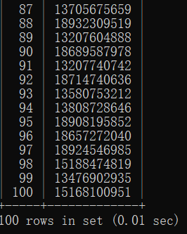
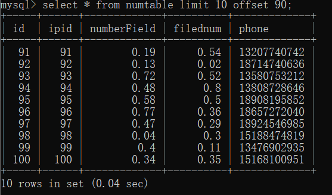

## 什么是存储过程？

存储过程是程序化的SQL，它可以直接操作底层数据表，用函数的思想处理一些更复杂的数据处理。存储过程由SQL语句和流程控制语句共同组成，它类似于函数可以接收输入参数，也可以返回输出给调用者。

### 如何创建一个存储过程？

定义一个存储过程：

```sql
CREATE PROCEDURE `存储过程名称`([参数列表]) 
BEGIN
	需要执行的语句
END
```

使用 CREATE PROCEDURE 创建一个存储过程，后面是存储过程的名称，输入或输出的参数，以及BEGIN AND 包裹的需要执行的语句块。

当我们存储过程代码需要更新，可以使用 `ALTER PROCEDURE 存储过程名`，创建过程中难免有错误，当我们需要删除原先的存储过程重新创建时，可以使用 `DROP PROCEDURE 存储过程`

举例：

```sql
//删除函数
DROP FUNCTION rand_number;
//删除存储过程
drop procedure if exists insert_mbi;
```

下面通过一个累加运算的例子来看下如何实现一个简单的存储过程：计算1+2+3+...+n

如果用的是 DataGrip 或者 Navicat 这种数据库连接工具，直接使用下面的执行语句：

```sql
CREATE PROCEDURE `add_num`(IN n INT) 
BEGIN
    DECLARE i INT;
    DECLARE sum INT;
    
    SET i=1;
    SET sum=0;	
    WHILE i	<= n DO
        SET sum=sum+i;
        SET i=i+1;
    END WHILE;
    SELECT sum;
END
```

如果用的 MySQL 命令行，使用下面的执行语句：

```sql
DELIMITER // 
CREATE PROCEDURE `add_num`(IN n INT) 
BEGIN
    DECLARE i INT;
    DECLARE sum INT;
    
    SET i=1;
    SET sum=0;	
    WHILE i	<= n DO
        SET sum=sum+i;
        SET i=i+1;
    END WHILE;
    SELECT sum;
END //
DELIMITER 
```

我们直接使用 CALL add_num(50)，即可算出 1+2+3+...+50 的和，为1275

下面我们来解释一下这个存储过程中的语句：


- 存储过程的三种参数类型：IN,OUT,INOUT

  参数类型：IN；        是否返回：否；作用：向存储过程传入参数，不能被返回

  参数类型：OUT；    是否返回：是；作用：把存储过程的计算结果放到该参数中，调用者可以得到返回值

  参数类型：INOUT；是否返回：是；作用：IN 和 OUT 的结合，既可以用于存储过程的传入参数，同事又可以把计算结果放到参数中，调用者可以得到返回值

- DECLARE 是声明的意思，用来声明变量及其类型，位于BEGIN和END之间，且需要在其他语句使用之前进行变量的声明。

- SET 是赋值语句

### 存储过程如何调用MySQL函数

下面我们来看一下如何用MySQL函数和存储过程来生成电话号码：

```sql
DELIMITER //
CREATE FUNCTION rand_num(n int) RETURNS VARCHAR(255)
BEGIN
    DECLARE chars_str varchar(20) DEFAULT '0123456789';
    DECLARE return_str varchar(255) DEFAULT '';
    DECLARE i INT DEFAULT 0;
    WHILE i < n DO
        SET return_str = concat(return_str,substring(chars_str , FLOOR(1 + RAND()*10 ),1));
        SET i = i +1;
    END WHILE;
    RETURN return_str;
END //
DELIMITER ;
```

- 生成函数用的是 CREATE FUNCTION 语句

- `DECLARE chars_str varchar(20) DEFAULT '0123456789';` 相当于

  ```sql
  DECLARE chars_str varchar(20);
  SET chars_str = '0123456789';
  ```

- 内置函数floor的作用是向下取整。所以floor(rand()*10+1)的取值范围为[1,10]。内置函数floor的作用是向下取整。所以floor(rand()*10+1)的取值范围为[1,10]。

- substring（str,x,y）是表示在字符串str中从x位置开始，截取长度为y的字符串。X从1到10，y为1。意思就是在 '0123456789' 这串字符串中随意截取一个字符。

- 内置函数concat(str1,str2,…strn)的作用是把字符串str1到strn拼接成一个字符串

上面得到的是一个随机的11位数字组成的字符串，但这就有一个问题，也有可能生出的是类似01234567899这种一看就不是手机号的字符串，因为手机号都有固定的手机头，因此我们来写一个模拟得到手机头的函数。

```sql
DELIMITER $$
create function phone_head() returns char(3)
begin
-- 130 131 132 133 134 135 136 137 138 139 186 187 189 151 157常用的手机头
declare head char(3);
declare bodys varchar(100) default "130 131 132 133 134 135 136 137 138 139 186 187 189 151 157";
declare starts int;
set starts = 1+floor(rand()*15)*4;    
set head = trim(substring(bodys,starts,3));
return head;
end $$
DELIMITER ;
```

- starts = 1+4*n(0<=n<=14)，所以starts 的取值是1,5,9,13...
- set head = substring(bodys,starts,3); 在字符串bodys中从starts位置截取三位，正好截取的是各个手机头。

下面我们来生成电话号码：

```sql
DELIMITER $$
create function gen_phone() returns varchar(20)
begin
declare phone varchar(20);
set phone = trim(concat(phone_head(),rand_num(8)));
return phone;
end $$
DELIMITER ;
```

phone_head() 生成3位电话号码头，rand_num(8) 生成8位数字，然后用 concat 函数将他们拼接在一起。

最后通过一个存储过程来生成电话号码：

```sql
DELIMITER $$
create procedure insert_phone(IN n INT)
begin
declare i int default 0;
declare phone varchar(20);
set phone = trim(concat(phone_head(),rand_num(8)));
while i<n do
insert into phone(phone) values(phone);
set i = i+1;
set phone = trim(concat(phone_head(),rand_num(8)));
end while;
end $$
DELIMITER ;
```

下一步就是创建一张表，然后调用这个存储过程往表中插入数据：

创建 phone 表：

```sql
DROP TABLE IF EXISTS `phone`;
CREATE TABLE `phone` (
  `id` int(10) unsigned NOT NULL AUTO_INCREMENT,
  `phone` varchar(20) DEFAULT NULL,
  PRIMARY KEY (`id`)
) ENGINE=InnoDB DEFAULT CHARSET=utf8;
```

调用存储过程生成100条电话号码：

```sql
call insert_phone;
```

查看 phone 表中有没有插入数据：

```sql
select * from phone;
```



## 什么是游标？

游标是一种灵活的操作方式，让我们可以从数据结果集中每次提取一条数据记录进行操作，游标让SQL这种面向集合的语言有了面向过程开发的能力。可以说，游标是一种面向过程的编程方式。

## 如何使用游标？

我们要想使用游标，一般需要经历五个步骤：

第一步，定义游标：

```sql
DECLARE cursor_name CURSOR FOR select_statement;
```

cursor_name 是游标名，select_statement 是 select 查询语句。定义游标的意思就是将 select 语句查到的值存到游标中。

第二步，打开游标：

```sql
OPEN cursor_name;
```

当我们定义好游标之后，如果想要使用游标，必须先打开游标，打开游标的时候 SELECT 语句的查询结果集就会送到游标工作区。

第三步，从游标中取得数据：

```sql
FETCH cursor_name INTO var_name ...;
```

当游标 cursor_name 读取到当前行时，将数据保存到 var_name 这个变量中，如果游标读取的数据行有多个列名，则在INTO关键字后面赋值给多个变量名即可。

第四部，关闭游标：

```sql
CLOSE cursor_name;
```

最后释放游标：

```sql
DEALLOCATE PREPARE cursor_name;
```

DEALLOCATE的作用是释放游标，不释放游标，游标就会一直存在于内存中，直到进程结束才会自动释放，因此当你不需要使用游标的时候，释放游标可以减少资源浪费。

下面我们结合之前的用存储过程生成的 phone 表来实现一个需求，实际演示一下游标怎么用？

需求如下：

一：创建一张新表 numtable：

```sql
DROP TABLE IF EXISTS `numtable`;
CREATE TABLE `numtable` (
  `id` int(10) unsigned NOT NULL AUTO_INCREMENT,
  `ipid` int(10) DEFAULT NULL,
  `numberField` float(20) DEFAULT NULL,
  `filednum` float(20) DEFAULT NULL,
  `phone` varchar(20) DEFAULT NULL,
  PRIMARY KEY (`id`)
) ENGINE=InnoDB DEFAULT CHARSET=utf8;
```

二：将 phone 表中的 id 和 phone 字段取出，id 的值插到新表 numtable 的 ipid 字段下，phone 的值插入到新表 numtable 的 phone 字段下，要求numberField 和 filednum 中插入随机两位小数。

存储过程加游标实现：

先写个函数用于生成两位小数的随机数：

```sql
DELIMITER //
CREATE FUNCTION rand_number() RETURNS FLOAT(20)
BEGIN
    DECLARE return_str FLOAT(20);
    SET return_str = round((RAND()*1.0),2);
    RETURN return_str;
END //
DELIMITER ;
```

再写一个存储过程里面用游标取 phone 表中的 id 和 phone 字段，存储过程调用生成两位小数的随机数的函数，并将他们一起插入到 numtable 表中：

```sql
DELIMITER //
CREATE PROCEDURE `insert_phoneNum`() 
BEGIN
	-- 创建接收游标的变量
    DECLARE iphone varchar(20);
    DECLARE iid int(10);
    
    -- 创建结束标志变量
    DECLARE done INT DEFAULT false;
    
    -- 定义游标
    DECLARE cur_num CURSOR FOR SELECT id,phone FROM phone;
    
    -- 当游标停在最后一行数据，并想继续执行时，将变量 done 的值修改为 true
    DECLARE CONTINUE HANDLER FOR NOT FOUND SET done = true;

    -- 打开游标
    OPEN cur_num;
    read_loop:LOOP
   
    -- 从游标中取数
    FETCH cur_num INTO iid,iphone;
    
    -- 如果 done 为 true，即当游标已经执行完全部数据时，离开循环
    IF done THEN
        LEAVE read_loop;
        
    -- 否则执行下面的插入语句
    END IF;
        INSERT INTO numtable(ipid,phone,numberField,filednum) values(iid,iphone,rand_number(),rand_number());
       
    -- 结束循环
    END LOOP;
    -- 关闭游标
    CLOSE cur_num;
    -- 释放游标
    DEALLOCATE PREPARE cur_num;
END //
DELIMITER ;
```

调用这个存储过程：

```sql
call insert_phoneNum();
```

查询 numtable 表：

```sql
select * from numtable;
```



可以看出和上面的 phone 表是对应的，随机数也插入了。

理解了这个，下面我们用存储过程加游标来实现一下我遇到的真实需求：

需要向测试环境中批量插入测试数据

```sql
select * from dim_shop; -- 门店主数据
select * from dim_branch; -- 分部主数据
select * from dim_product_category; -- 品类主数据
select * from dim_sale_channel; -- 销售渠道数据
select * from dim_date; -- 日期主数据

select branch_code, -- dim_branch
       branch_name, -- dim_branch
       shop_code, -- dim_shop
       shop_name, -- dim_shop
       channel_code, -- dim_sale_channel
       channel_name, -- dim_sale_channel
       category_code, -- dim_product_category
       category_name, -- dim_product_category
       sale_amount_no_tax_d,-- 插入随机2位小数
       sale_amount_no_tax_w,-- 插入随机2位小数
       sale_amount_no_tax_m,-- 插入随机2位小数
       sale_amount_no_tax_q,-- 插入随机2位小数
       sale_amount_no_tax_y,-- 插入随机2位小数
       sale_margin_d,-- 插入随机2位小数
       sale_margin_w,-- 插入随机2位小数
       sale_margin_m,-- 插入随机2位小数
       sale_margin_q,-- 插入随机2位小数
       sale_margin_y,-- 插入随机2位小数
       sale_amount_no_tax_d_ly,-- 插入随机2位小数
       sale_amount_no_tax_w_ly,-- 插入随机2位小数
       sale_amount_no_tax_m_ly,-- 插入随机2位小数
       sale_amount_no_tax_q_ly,-- 插入随机2位小数
       sale_amount_no_tax_y_ly,-- 插入随机2位小数
       sale_margin_d_ly,-- 插入随机2位小数
       sale_margin_w_ly,-- 插入随机2位小数
       sale_margin_m_ly,-- 插入随机2位小数
       sale_margin_q_ly,-- 插入随机2位小数
       sale_margin_y_ly,-- 插入随机2位小数
       yoy_flag, -- 默认 '1'
       yoy_flag_ly, -- 默认 '1'
       sale_weekday, -- dim_date
       sale_week, -- dim_date
       sale_month, -- dim_date
       sale_quarter, -- dim_date
       sale_year, -- dim_date
       sale_date_ly, -- dim_date
       end_of_week_flag, -- 暂不插入
       end_of_month_flag, -- 暂不插入
       end_of_quarter_flag, -- 暂不插入
       end_of_year_flag, -- 暂不插入
       bi_week_type, -- 暂不插入
       etl_time, -- current_timestamp
       sale_date -- dim_date,不带"-"格式
from mbi_sale_analysis_by_category_daily;
```

前面五行是已有数据的维度表，需要向一张新表 mbi_sale_analysis_by_category_daily 维度列中插入已知维度表中的值，而指标列都插入2位精度的小数。

用 show create table mbi_sale_analysis_by_category_daily; 语句可以查看表字段注释。

下面我们就结合存储过程加游标完成这个功能：

首先用函数生成随机的两位小数：

```sql
-- 函数用于随机生成两位小数
CREATE FUNCTION rand_number() RETURNS FLOAT(20)
BEGIN
    DECLARE return_str FLOAT(20);
    SET return_str = round((RAND()*1.0),2);
    RETURN return_str;
END
```

其次存储过程加游标实现此功能，思路和上面一样就是字段多了一点：

```sql
-- 存储过程
CREATE PROCEDURE `insert_mbi`()
BEGIN

    DECLARE fshop_code varchar(10);
    DECLARE fshop_name varchar(50);
    DECLARE fbranch_code varchar(10);
    DECLARE fbranch_name varchar(50);
    DECLARE fcategory_code varchar(10);
    DECLARE fcategory_name varchar(50);
    DECLARE fchannel_code varchar(10);
    DECLARE fchannel_name varchar(50);
    DECLARE fsale_date_ly varchar(10);
    DECLARE fsale_month varchar(10);
    DECLARE fsale_quarter varchar(10);
    DECLARE fsale_year varchar(10);
    DECLARE fsale_week varchar(10);
    DECLARE fsale_weekday varchar(10);
    DECLARE fsale_date varchar(10);

    DECLARE done INT DEFAULT false;
    DECLARE cur_num CURSOR FOR select s.shop_code,s.shop_name,
       b.branch_code,b.branch_name,
       c.category_code,c.category_name,
       t.sale_channel_code as channel_code,
       t.sale_channel_name as channel_name,
       d.date_day as sale_date_ly,
       d.date_month as sale_month,
       d.date_quarter as sale_quarter,
       d.date_year as sale_year,
       d.week_of_year as sale_week,
       d.day_of_week as sale_weekday,
       replace(d.date_day_format, '-', '') as sale_date
       from app.dim_shop s
       left join app.dim_branch b
       on s.branch_code = b.branch_code
       and b.branch_code in ('10','92')
       join app.dim_product_category c
       on b.valid_flag = c.valid_flag
       join app.dim_sale_channel t
       on t.sale_channel_code in ('03','04','12','20','19')
       join app.dim_date d where d.date_day>=20200101 and d.date_day<=20201231;

    DECLARE CONTINUE HANDLER FOR NOT FOUND SET done = true;

    OPEN cur_num;
    read_loop:LOOP
    FETCH cur_num INTO fshop_code,fshop_name,fbranch_code,fbranch_name,fcategory_code,fcategory_name,fchannel_code,fchannel_name,fsale_date_ly,fsale_month,fsale_quarter,fsale_year,fsale_week,fsale_weekday,fsale_date;

    IF done THEN
        LEAVE read_loop;
    END IF;

        INSERT INTO mbi_sale_analysis_by_category_daily_copy(
        shop_code,
        shop_name,
        branch_code,
        branch_name,
        category_code,
        category_name,
        channel_code,
        channel_name,
        sale_date_ly,
        sale_month,
        sale_quarter,
        sale_year,
        sale_week,
        sale_weekday,
        sale_date,

        sale_amount_no_tax_d,
        sale_amount_no_tax_w,
        sale_amount_no_tax_m,
        sale_amount_no_tax_q,
        sale_amount_no_tax_y,
        sale_margin_d,
        sale_margin_w,
        sale_margin_m,
        sale_margin_q,
        sale_margin_y,
        sale_amount_no_tax_d_ly,
        sale_amount_no_tax_w_ly,
        sale_amount_no_tax_m_ly,
        sale_amount_no_tax_q_ly,
        sale_amount_no_tax_y_ly,
        sale_margin_d_ly,
        sale_margin_w_ly,
        sale_margin_m_ly,
        sale_margin_q_ly,
        sale_margin_y_ly,
        yoy_flag,
        yoy_flag_ly,
        etl_time
        ) values(
        fshop_code,
        fshop_name,
        fbranch_code,
        fbranch_name,
        fcategory_code,
        fcategory_name,
        fchannel_code,
        fchannel_name,
        fsale_date_ly,
        fsale_month,
        fsale_quarter,
        fsale_year,
        fsale_week,
        fsale_weekday,
        fsale_date,

        rand_number(),
        rand_number(),
        rand_number(),
        rand_number(),
        rand_number(),
        rand_number(),
        rand_number(),
        rand_number(),
        rand_number(),
        rand_number(),
        rand_number(),
        rand_number(),
        rand_number(),
        rand_number(),
        rand_number(),
        rand_number(),
        rand_number(),
        rand_number(),
        rand_number(),
        rand_number(),
        '1',
        '1',
        curdate());

    END LOOP;
    CLOSE cur_num;
    DEALLOCATE PREPARE cur_num;
END
```

执行存储过程：

```sql
-- 执行存储过程
call insert_mbi();
```

最终生成了270多万条数据，耗时39分钟23秒


但这个耗时却不是十分令人满意，因为游标是一条一条处理，在使用游标的过程中会对数据进行加锁，这样在业务并发量大的情况下，会出现性能问题。

因此直接使用 INSERT INTO ... SELECT ... 语句插入性能会更好

```sql
INSERT INTO mbi_sale_analysis_by_category_daily(sale_amount_no_tax_d,-- 插入随机2位小数
                                                sale_amount_no_tax_w,-- 插入随机2位小数
                                                sale_amount_no_tax_m,-- 插入随机2位小数
                                                sale_amount_no_tax_q,-- 插入随机2位小数
                                                sale_amount_no_tax_y,-- 插入随机2位小数
                                                sale_margin_d,-- 插入随机2位小数
                                                sale_margin_w,-- 插入随机2位小数
                                                sale_margin_m,-- 插入随机2位小数
                                                sale_margin_q,-- 插入随机2位小数
                                                sale_margin_y,-- 插入随机2位小数
                                                sale_amount_no_tax_d_ly,-- 插入随机2位小数
                                                sale_amount_no_tax_w_ly,-- 插入随机2位小数
                                                sale_amount_no_tax_m_ly,-- 插入随机2位小数
                                                sale_amount_no_tax_q_ly,-- 插入随机2位小数
                                                sale_amount_no_tax_y_ly,-- 插入随机2位小数
                                                sale_margin_d_ly,-- 插入随机2位小数
                                                sale_margin_w_ly,-- 插入随机2位小数
                                                sale_margin_m_ly,-- 插入随机2位小数
                                                sale_margin_q_ly,-- 插入随机2位小数
                                                sale_margin_y_ly,-- 插入随机2位小数
                                                yoy_flag, -- 默认 '1'
                                                yoy_flag_ly, -- 默认 '1'
                                                etl_time, -- current_timestamp

                                                shop_code, -- dim_shop
                                                shop_name, -- dim_shop
                                                branch_code, -- dim_branch
                                                branch_name, -- dim_branch
                                                category_code, -- dim_product_category
                                                category_name, -- dim_product_category
                                                channel_code, -- dim_sale_channel
                                                channel_name, -- dim_sale_channel

                                                sale_date_ly, -- dim_date
                                                sale_month, -- dim_date
                                                sale_quarter, -- dim_date
                                                sale_year, -- dim_date
                                                sale_week, -- dim_date
                                                sale_weekday, -- dim_date
                                                sale_date -- dim_date,不带"-"格式
) select * from (select round(rand(), 2) as sale_amount_no_tax_d,
                      round(rand(), 2) as sale_amount_no_tax_w,
                      round(rand(), 2) as sale_amount_no_tax_m,
                        round(rand(), 2) as sale_amount_no_tax_q,
                      round(rand(), 2) as sale_amount_no_tax_y,
                        round(rand(), 2) as sale_margin_d,
                      round(rand(), 2) as sale_margin_w,
                      round(rand(), 2) as sale_margin_m,
                        round(rand(), 2) as sale_margin_q,
                      round(rand(), 2) as sale_margin_y,
                        round(rand(), 2) as sale_amount_no_tax_d_ly,
                      round(rand(), 2) as sale_amount_no_tax_w_ly,
                      round(rand(), 2) as sale_amount_no_tax_m_ly,
                        round(rand(), 2) as sale_amount_no_tax_q_ly,
                      round(rand(), 2) as sale_amount_no_tax_y_ly,
                        round(rand(), 2) as sale_margin_d_ly,
                      round(rand(), 2) as sale_margin_w_ly,
                      round(rand(), 2) as sale_margin_m_ly,
                        round(rand(), 2) as sale_margin_q_ly,
                      round(rand(), 2) as sale_margin_y_ly,
                        '1' as yoy_flag,
                        '1' as yoy_flag_ly,
                        curdate() as etl_time,
                        s.shop_code,s.shop_name,
       b.branch_code,b.branch_name,
       c.category_code,c.category_name,
       t.sale_channel_code as channel_code,t.sale_channel_name as channel_name,
       d.date_day as sale_date_ly,
       d.date_month as sale_month,
       d.date_quarter as sale_quarter,
       d.date_year as sale_year,
       d.week_of_year as sale_week,
       d.day_of_week as sale_weekday,
        replace(d.date_day_format, '-', '') as sale_date
       from app.dim_shop s

    left join app.dim_branch b
    on s.branch_code = b.branch_code
    and b.branch_code in ('10','92')
    join app.dim_product_category c
    on b.valid_flag = c.valid_flag
    join app.dim_sale_channel t
    on t.sale_channel_code in ('03','04','12','20','19')
    join app.dim_date d where d.date_day>=20200101 and d.date_day<=20201231) as a;
```

实测插入耗时2分14秒：


本周着重理解了MySQL的存储过程和游标，最终实现向测试环境中批量插入270万测试数据。